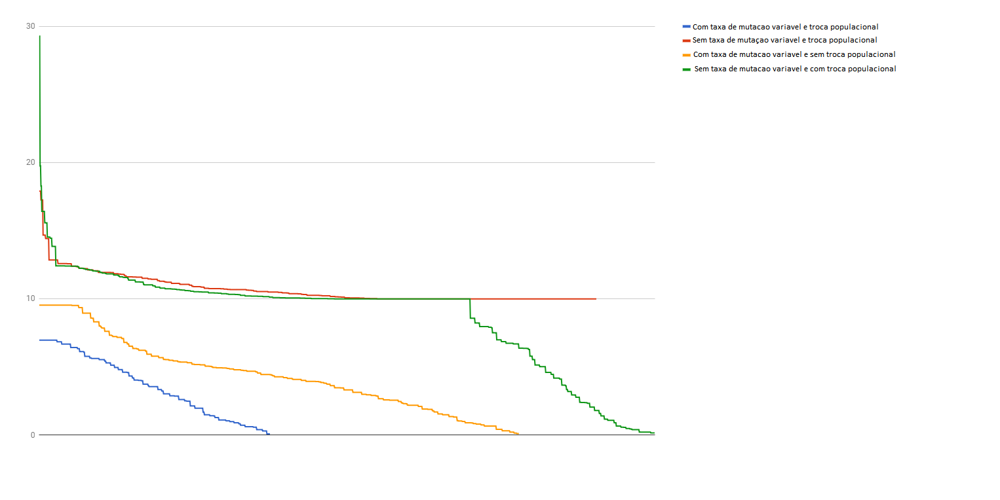

# SSC0713 Sistemas Evolutivos Aplicados a Robotica/2017 - Braco Robotico

Utilizando arduino para controlar um braco robotico com tres graus de liberdade, um algoritmo genetico foi desenvolvido no intuito de que o proprio algoritmo evoluisse para chegar de um ponto A ate um ponto B atraves da medicao da menor distancia euclidiana atingida pelo movimento genetico ao ponto de destino. 

O grafico de distancia do ponto de destino(em cm) _versus_ geracoes ate o resultado demonstra a eficacia de diferentes abordagens para a implementacao do processo evolutivo em si.

